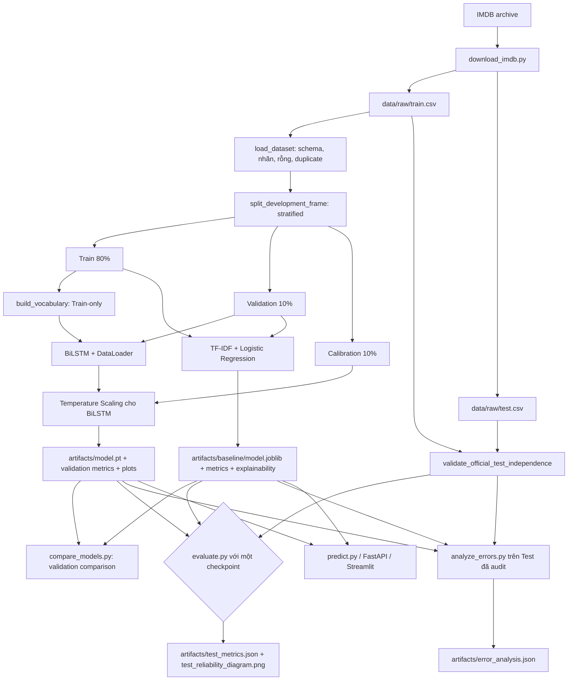

# CineSentiment

[](https://www.python.org/)
[](https://pytorch.org/)
[](https://scikit-learn.org/)
[](https://fastapi.tiangolo.com/)
[](https://streamlit.io/)
[](https://github.com/haminhthong/Imdb-Sentiment-Analysis/actions/workflows/quality.yml)

CineSentiment là dự án thực nghiệm phân loại cảm xúc nhị phân cho review phim IMDB bằng tiếng Anh. Mã nguồn có hai nhánh mô hình để đối chiếu:

- Baseline: TF-IDF unigram/bigram và Logistic Regression.
- Deep learning: BiLSTM word-level với padding, cắt chuỗi `head_tail` và `pack_padded_sequence`.

Mục tiêu của repo là làm rõ chất lượng mô hình, kiểm soát rò rỉ dữ liệu và cung cấp một CLI, một REST API FastAPI cùng một giao diện Streamlit nhỏ để dùng checkpoint đã huấn luyện. Đây không phải hệ thống thu thập dữ liệu hay một nền tảng vận hành nhiều môi trường.

## Bài toán & Phạm vi ứng dụng

### Bài toán

Với một review phim tiếng Anh, hệ thống dự đoán một trong hai nhãn:

- `Negative` tương ứng với `label = 0`.
- `Positive` tương ứng với `label = 1`.

Mỗi tệp CSV đầu vào phải có ít nhất hai cột bắt buộc là `text` và `label`; các cột khác sẽ được bỏ qua. Bộ tải dữ liệu kiểm tra giá trị rỗng, nhãn ngoài `{0, 1}`, bản ghi trùng nội dung và bản ghi trùng nhưng khác nhãn.

### Phạm vi

- Dữ liệu chuẩn: Large Movie Review Dataset (IMDB), gồm `train.csv` và `test.csv`.
- Ngôn ngữ: tiếng Anh; tokenizer bảo tồn các dạng phủ định như `don't`, `isn't`, `can't`.
- Huấn luyện: chỉ dùng tập Train chính thức; tập Train được chia thành Train/Validation/Calibration.
- Đánh giá cuối: chỉ chạy trên tập Test chính thức sau khi kiểm tra overlap với Train.
- Suy luận: nhận một review hoặc một batch tối đa 100 review qua CLI, FastAPI hoặc Streamlit.
- Ngoài phạm vi: dịch thuật, multi-class sentiment, huấn luyện online, lưu dữ liệu người dùng và tự động triển khai.

## Luồng logic, luồng dữ liệu và pipeline kỹ thuật

Đây là pipeline chuẩn duy nhất được dùng để diễn giải mã nguồn, cấu hình, artifact và báo cáo của repo:



### Luồng dữ liệu chi tiết

1. `scripts/download_imdb.py` tải archive IMDB, đọc thư mục `pos`/`neg` và ghi hai CSV vào `data/raw/`. Dữ liệu đầy đủ không được commit.
2. `sentiment.data_validation.load_dataset()` chỉ giữ `text`, `label`, chuẩn hóa để phát hiện trùng và loại duplicate nội bộ ở những bước phát triển.
3. `sentiment.data.split_development_frame()` chia tập Train theo seed thành ba phần. Tập Test không đi qua bước chọn mô hình.
4. `sentiment.text.build_vocabulary()` chỉ nhìn các review của split Train. Từ không có trong vocabulary trở thành `<UNK>`; `<PAD>` dùng cho padding.
5. `sentiment.data.IMDBDataset` tokenize và encode on-the-fly. Review dài hơn `max_length` được cắt theo `first` hoặc `head_tail`, mặc định là `256` token.
6. BiLSTM được huấn luyện bằng `sentiment.engine.train_model()`, dừng sớm theo Validation Loss. Temperature Scaling chỉ học trên Calibration split.
7. Baseline fit TF-IDF và Logistic Regression trên split Train, rồi tính metrics trên Validation. Baseline không dùng Temperature Scaling.
8. `evaluate.py` nạp lại Train và Test, gọi `validate_official_test_independence()` trước khi đánh giá. Nếu phát hiện overlap, quy trình dừng với lỗi dữ liệu.
9. Predictor dùng cùng checkpoint contract với CLI, API và app: `model.pt` cho BiLSTM hoặc `model.joblib` cho baseline. Kết quả gồm nhãn, xác suất Positive, số token, OOV, cờ truncation và cảnh báo.

### Metrics và artifact

Các metrics được tính trong code, không hard-code vào README:

- Phân loại: Accuracy, Macro-F1, ROC-AUC, PR-AUC.
- Xác suất: Log Loss, Brier Score, ECE với 10 bins.
- BiLSTM: training history, confusion matrix và reliability diagram validation.
- Đánh giá Test: reliability diagram và `test_metrics.json` theo checkpoint được chọn.
- Baseline: `validation_metrics.json` và `explainability.json`, không tạo plot huấn luyện.
- So sánh: số tham số và latency CPU đo trên cùng một câu mẫu.

Artifact do các lệnh tạo ra nằm trong `artifacts/`, được gitignore để tránh đưa model và báo cáo sinh tự động vào source repository. BiLSTM tạo `model.pt`, `validation_metrics.json`, `training_history.png`, `confusion_matrix.png` và `reliability_diagram.png`. Baseline tạo `baseline/model.joblib`, `baseline/validation_metrics.json` và `baseline/explainability.json`. `evaluate.py` tạo `test_metrics.json` và `test_reliability_diagram.png`; `compare_models.py` tạo `model_comparison.md`; `analyze_errors.py` tạo `error_analysis.json`.

## Cấu trúc thư mục dự án

```text
.
├── api.py                         # FastAPI: /health, /predict, /predict/batch
├── app.py                         # Streamlit demo review đơn và batch
├── baseline.py                    # TF-IDF + Logistic Regression
├── compare_models.py              # So sánh artifact validation và latency
├── evaluate.py                    # Đánh giá cuối trên Test và kiểm tra overlap
├── load_test.py                   # Đo tải thủ công cho endpoint /predict
├── predict.py                     # Dự đoán từ CLI hoặc tệp .txt
├── train.py                       # Huấn luyện BiLSTM và calibration
├── MODEL_CARD.md                  # Phạm vi, giới hạn và mô tả model
├── pyproject.toml                 # Dependency, CLI entry point, Ruff, pytest
├── requirements.txt               # Danh sách dependency pip; không thay pyproject
├── .gitignore                     # Loại dữ liệu/model/cache sinh tự động
├── .gitattributes                 # Quy ước newline của repository
├── .env.example                   # CHECKPOINT_PATH dùng chung cho API/app
├── .github/workflows/quality.yml  # CI: install, compile, Ruff, pytest
├── sentiment/
│   ├── __init__.py                # Khai báo package sentiment
│   ├── artifacts.py               # Lưu checkpoint, JSON và biểu đồ
│   ├── calibration.py             # Temperature, Brier, ECE, Log Loss
│   ├── config.py                  # ExperimentConfig và validation
│   ├── data.py                    # Split, Dataset, DataLoader, audit
│   ├── data_validation.py         # Schema, duplicate, overlap, length stats
│   ├── engine.py                  # Training loop, early stopping, metrics
│   ├── inference.py               # Predictor BiLSTM/baseline và result contract
│   ├── model.py                   # BiLSTM classifier
│   ├── text.py                    # Tokenizer, vocabulary, encode/padding
│   └── utils.py                   # Seed, device và latency
├── scripts/
│   ├── __init__.py                # Cho phép chạy scripts bằng python -m
│   ├── analyze_errors.py          # Phân tích lỗi theo Test đã audit
│   ├── create_smoke_dataset.py    # Tạo fixture nhỏ cho kiểm thử thủ công
│   └── download_imdb.py           # Tải và chuyển IMDB thành CSV
├── tests/                         # Unit test cho API, data, model, CLI helper
│   └── fixtures/imdb_smoke/       # Fixture smoke tạo thủ công
├── data/raw/                      # train.csv/test.csv; không commit dữ liệu
├── data/processed/                # Chỗ dành cho dữ liệu xử lý thêm
├── data/README.md                 # Quy ước lưu dữ liệu và fixture
└── artifacts/                     # Checkpoint/báo cáo; chỉ giữ .gitkeep
```

## Cài đặt

Yêu cầu Python `3.10` trở lên. `pyproject.toml` là nguồn cấu hình dependency chính.

```bash
git clone https://github.com/haminhthong/Imdb-Sentiment-Analysis.git
cd Imdb-Sentiment-Analysis
python -m venv .venv
```

Kích hoạt môi trường:

```bash
# Windows PowerShell
.venv\Scripts\Activate.ps1

# Linux/macOS
source .venv/bin/activate
```

Cài project ở chế độ editable cùng công cụ phát triển:

```bash
python -m pip install --upgrade pip
python -m pip install -e ".[dev]"
```

Nếu PowerShell chặn script activate, có thể gọi trực tiếp `.venv\Scripts\python.exe -m pip ...` mà không cần đổi policy hệ thống.

## Chạy thử nghiệm theo đúng pipeline

### 1. Tạo dữ liệu IMDB

```bash
python -m scripts.download_imdb
```

Kết quả là `data/raw/train.csv` và `data/raw/test.csv`. Lệnh không ghi đè dữ liệu đã có nếu thiếu cờ `--force`.

Để kiểm tra nhanh parser mà không tải bộ dữ liệu lớn:

```bash
python -m scripts.create_smoke_dataset
```

Fixture smoke chỉ dùng để kiểm tra thủ công, không đại diện cho chất lượng IMDB và không thay thế Test chính thức. Unit test CI tự tạo dữ liệu tạm trong `tmp_path` hoặc dùng mock, không tải bộ IMDB.

### 2. Huấn luyện baseline

```bash
python baseline.py --train-data data/raw/train.csv --output-dir artifacts/baseline
```

Baseline ghi `model.joblib`, `validation_metrics.json` và `explainability.json` vào `artifacts/baseline/`.

### 3. Huấn luyện BiLSTM

```bash
python train.py \
  --train-data data/raw/train.csv \
  --output-dir artifacts \
  --epochs 15 \
  --batch-size 128 \
  --max-length 256 \
  --truncation-strategy head_tail
```

Có thể dùng `--max-samples` để chạy smoke nhỏ hoặc `--device cpu`/`--device cuda` để chọn thiết bị. Kết quả chính là `artifacts/model.pt` và các metrics/plot validation.

### 4. So sánh hai mô hình

Chạy sau khi đã có cả hai artifact:

```bash
python compare_models.py
```

Lệnh đọc `artifacts/baseline/` và `artifacts/`, in bảng so sánh rồi ghi `artifacts/model_comparison.md`.

### 5. Đánh giá Test chính thức

```bash
python evaluate.py --checkpoint artifacts/model.pt
```

Lệnh mặc định yêu cầu cả `data/raw/train.csv` và `data/raw/test.csv`. Có thể truyền đường dẫn khác bằng `--train-data`, `--test-data`, `--checkpoint`, `--output-dir`. Mỗi lần chạy đánh giá đúng một checkpoint; truyền `artifacts/model.pt` cho BiLSTM hoặc `artifacts/baseline/model.joblib` cho baseline. Trước khi tính metrics, code kiểm tra overlap Train/Test và dừng nếu có rò rỉ.

### 6. Phân tích lỗi

```bash
python -m scripts.analyze_errors \
  --train-data data/raw/train.csv \
  --data data/raw/test.csv \
  --checkpoint artifacts/model.pt \
  --output artifacts/error_analysis.json
```

Báo cáo gồm lỗi tổng thể, lỗi tự tin cao, lát cắt phủ định/cảm xúc hỗn hợp/đảo chiều, độ dài và OOV. Bước này cũng kiểm tra Test độc lập với Train.

### 7. Dự đoán một review

```bash
python predict.py \
  "This movie was beautifully directed and passionately acted!" \
  --checkpoint artifacts/model.pt
```

Đối với baseline, truyền `--checkpoint artifacts/baseline/model.joblib`. Nếu đối số `text` là đường dẫn tệp `.txt`, CLI sẽ đọc nội dung tệp đó.

## Chạy API và giao diện

### FastAPI

API đọc checkpoint từ biến `CHECKPOINT_PATH`, mặc định là `artifacts/model.pt`.

```bash
python api.py
```

Hoặc:

```bash
uvicorn api:app --host 127.0.0.1 --port 8000
```

Sau khi API đang chạy, có thể đo tải thủ công bằng script chỉ dùng thư viện chuẩn:

```bash
python load_test.py --url http://127.0.0.1:8000/predict --users 10 --requests 50
```

Các endpoint hiện có:

- `GET /health`: kiểm tra API process.
- `POST /predict`: body `{"text": "..."}`.
- `POST /predict/batch`: body `{"texts": ["...", "..."]}`, tối đa 100 review.
- `/docs`: Swagger UI do FastAPI cung cấp.

Ví dụ:

```bash
curl -X POST "http://127.0.0.1:8000/predict" \
  -H "Content-Type: application/json" \
  -d '{"text":"The story was moving and the acting was excellent."}'
```

Response có dạng:

```json
{
  "label": "Positive",
  "probability": 0.9123,
  "truncated": false,
  "oov_rate": 0.0,
  "token_count": 10,
  "warnings": []
}
```

### Streamlit

```bash
streamlit run app.py
```

App có hai tab: phân tích một review và phân tích batch theo từng dòng. Đường dẫn checkpoint có thể đổi ở sidebar; app hỗ trợ `model.pt` và `model.joblib` theo cùng predictor contract với API/CLI.

## Kiểm thử và CI

Chạy các bước giống workflow GitHub Actions:

```bash
python -m compileall -q api.py app.py baseline.py compare_models.py evaluate.py load_test.py predict.py train.py sentiment scripts tests
python -m ruff check .
python -m ruff format --check .
python -m pytest -q
```

Workflow `.github/workflows/quality.yml` chạy trên Python 3.11 ở mỗi `push` và `pull_request`, theo thứ tự cài dependency, compile source, Ruff static check, Ruff format check và unit test. CI không cần dữ liệu IMDB hay checkpoint: test suite tự tạo dữ liệu tạm và mock predictor API ở nơi cần thiết.

## Biến môi trường

File `.env.example` chỉ mô tả biến mà code hiện tại thực sự đọc:

```text
CHECKPOINT_PATH=artifacts/model.pt
```

API và Streamlit đều đọc biến môi trường này; file `.env.example` chỉ là mẫu, không được tự động nạp. Nếu không đặt, chúng dùng checkpoint mặc định `artifacts/model.pt`. Không commit dữ liệu, checkpoint hoặc báo cáo sinh tự động vào source repository.

## Giới hạn

- Mô hình chỉ được huấn luyện cho tiếng Anh và miền review phim IMDB.
- Sarcasm, phủ định kép, cảm xúc hỗn hợp và đảo chiều ở cuối review có thể gây sai.
- Với BiLSTM, review dài hơn 256 token có thể bị cắt; token ngoài vocabulary trở thành `<UNK>`. Baseline TF-IDF không dùng padding/truncation của BiLSTM.
- Metrics chỉ có ý nghĩa sau khi chạy trên dữ liệu IMDB chính thức; fixture smoke không dùng để báo cáo chất lượng.

## Giấy phép

Xem [LICENSE](LICENSE).
